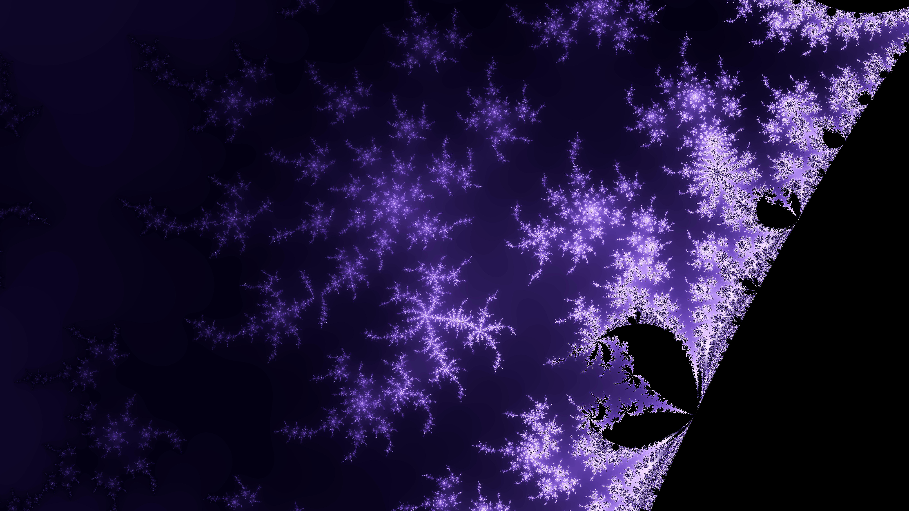

<p align="center">
  
</p>

<p align="center">
  
  
  
  
  

</p>

<p align="center">💠 Terminal based fractal explorer, including Mandelbrot, Burning Ship, and Julia. 💠</p>



# Documentation ✨

#### [**✨ ⟼ Please head over to our documentation for more information! ⟻ ✨**](https://rsfrac.skwal.net)

# Rsfrac

<p align="center">
  
</p>

# How to install 📥

#### [**✨ ⟼ For up-to-date instructions, please head over to our documentation ⟻ ✨**](https://rsfrac.skwal.net/getting-started.html)


To install build dependencies:

```bash
sudo apt install build-essentials m4
```

From [crates.io](https://crates.io/):

```bash
cargo install rsfrac
```

From [the Github repo](https://github.com/SkwalExe/rsfrac):

```bash
cargo install --git https://github.com/SkwalExe/rsfrac
```

You can now start the application with the `rsfrac` command.

### `cargo` not found?

Cargo is the package manager for rust projects, it can be installed with:

```bash
curl --proto '=https' --tlsv1.2 -sSf https://sh.rustup.rs | sh
```

# Features 🌟

### **⚡ Hardware-accelerated**

Rsfrac leverages GPU capabilities and parallel processing for complex arithmetic operations, enabling smooth navigation and rapid rendering.

### **🔢 High Precision Arithmetics**

Using GMP, MPFR and MPC, Rsfrac allows you to explore fractals infinitely deep by enabling users to increase the decimal precision for calculations as needed.

### **📸 High Quality Screenshots**

Rsfrac not only allows you to explore fractals at terminal resolution but also lets you generate high-resolution captures of your current view.

### **✨ Next-gen Terminal User Interface**

Rsfrac utilizes modern libraries such as Ratatui to provide a full-featured navigation experience, all this in your classic terminal. Rsfrac also supports customizable mouse inputs, allowing for seemless navigation.

### **📌 Robust Command System**

Rsfrac offers a robust command system that goes beyond simple fractal navigation. Additional features include capturing high-definition screenshots, adjusting render settings, modifying navigation preferences, changing colors, and much more.

### **⚙️ Modular Rendering Engine**

Rsfrac's underlying rendering engine is highly modular. The integrated command system enables you to inspect and modify technical parameters, allowing you to explore beyond the basic Mandelbrot and Julia sets. The combination of adjustable parameters makes the number of possible fractals effectively infinite.

# Screenshots 🌟

[💎 Here is some eye candy that I generated while creating this app!](https://rsfrac.skwal.net/screenshots.html)

# Additional info

```bash
# Creating statically linked build for web runner
RUSTFLAGS='-C target-feature=+crt-static' cargo build --features web-runner --release --target x86_64-unknown-linux-gnu
```
