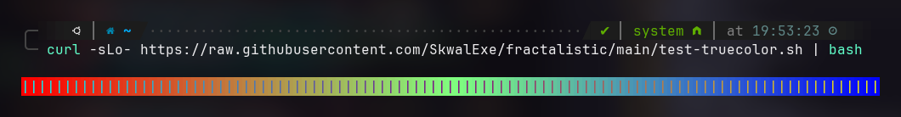

# Color Issues ❗ {#color-issues}

**In good conditions, the app should use 24-bit colors which looks like this:**


However, it is possible that when you open the app, the colors are not displaying correctly. In this case, it can mean that your terminal supports only 4-bits or 8-bits ANSI colors.

Therefore, your must ensure that your terminal supports 24-bit colors (truecolor). You can verify this by copying and pasting the following command into your terminal:

```bash
curl -sLo- https://raw.githubusercontent.com/SkwalExe/rsfrac/main/test-truecolor.sh | bash
```

> Please note that running `curl ... | bash` commands can be dangerous and is generally considered a bad practice unless you are certain that the script originates from a trustworthy source.

You should see smooth output similar to the screenshot below. If not, consider updating your terminal or switching to a more modern terminal that supports 24-bit colors.



If your terminal supports 24-bit colors but the colors are still not displaying correctly, you might need to set the following environment variable when running the app:

```bash
COLORTERM=truecolor rsfrac
```

Additionally, consider adding this to your `~/.bashrc` or `~/.zshrc` to make the change permanent:

```bash
export COLORTERM=truecolor
```
