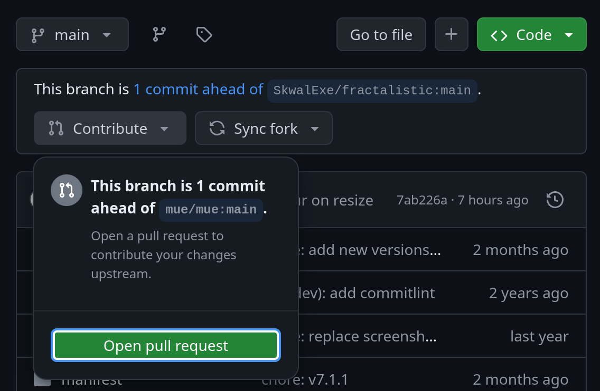

# Creating a pull request 🩷

When you finish your changes, you can then start to prepare your pull request.

First, check for any formatting, type, or linting errors.

```bash
cargo fmt
cargo check
cargo clippy --fix
```

Then run the unit tests to check you didn't break anything.

```bash
cargo test
```

Any problem that wasn't automatically corrected must be fixed manually before creating your pull request. If everything is OK, you can commit your changes to your own fork.

```bash
git add --all
git commit -m "My new feature"
git push origin main
```

And finally, from your fork's repository, you can now open a new pull request.
I should receive a notification and I will review your changes!



#### **Thank you for making it this far—your contribution means the world to me, and I can't express how happy it makes me. If you're just reading the documentation and haven't contributed yet, thank you for your interest in this project. 🩷**


