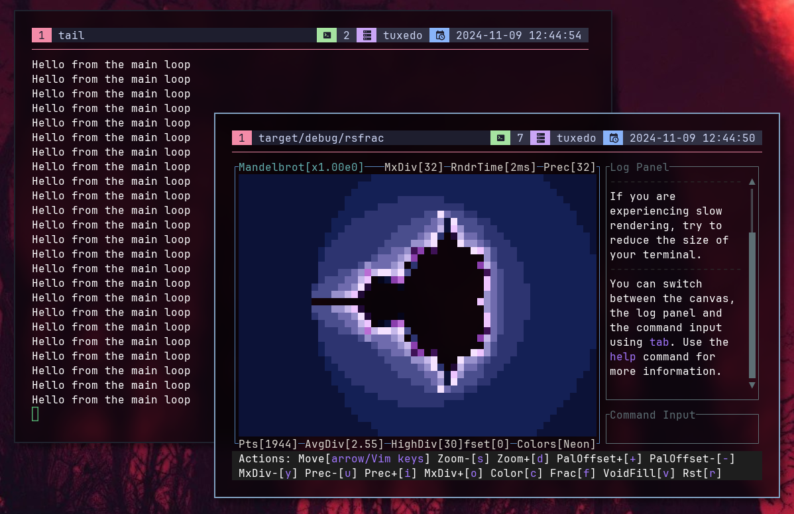

# Project setup 🏗️ {#projec-setup}

Before you start programming, you must setup the project locally.

First, you will need to [**fork**](https://docs.github.com/en/pull-requests/collaborating-with-pull-requests/working-with-forks/fork-a-repo) the [Github repository](https://github.com/SkwalExe/rsfrac), and clone it.

```bash
# Replace SkwalExe with your github username
git clone https://github.com/SkwalExe/rsfrac
cd rsfrac
```

> [Cargo](https://doc.rust-lang.org/cargo/) is the Rust package manager. \
> If you need to install it, you can do so as follows on Linux systems:
>
> ```bash
> curl --proto '=https' --tlsv1.2 -sSf https://sh.rustup.rs | sh
> ```

You can now start to make changes!

### Running the app

Since Rsfrac uses a TUI (GUI-like interface but in the terminal) you cannot use simple `println!()` statements.

You will need to open 2 separate terminals.
In the first one run `touch rsfrac.log && tail -f rsfrac.log`, and in the second one, run the app and add `2> rsfrac.log` at the end of the command line (for example `cargo run 2> rsfrac.log`).

This will open the app while **redirecting stderr to `rsfrac.log`**, allowing you to send log messages
to the first terminal. To log messages within the code,
you must use the `eprintln!()` macro to print to `stderr`.

For example, this is what is looks like when adding `eprintln!("...");` in the main loop:


