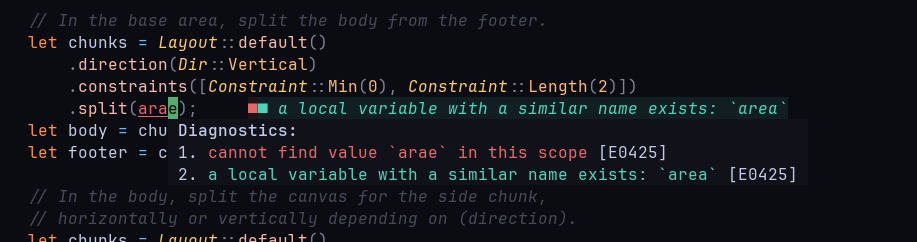

# Recommended IDE Setup ✅ {#recommended-setup}

Writing code is good, but writing code with the assistance of autocomplete,
autoformatting, error notifications, and linting is even better. ✨

You are not required to use the tools mentioned below in your IDE.
However, keep in mind that once you finish your changes,
**your code must still conform to the project's quality standards.**

::: tip No worries 💫
You will be able to detect and correct errors automatically with the help of terminal tools,
even if you don't use any of the IDE integrations presented below.

This will be covered in a later section.
:::

### Type-checking and formatting 🦀 {#type-checking-and-formatting}

You should use [Rust Analyzer](https://rust-analyzer.github.io/) for type-checking and formatting within the codebase.
It is recommended that you install this tool in your IDE, to benefit from automatic type-checking and formatting.

- [Github repo for rust-analyzer](https://github.com/rust-lang/rust-analyzer)
- [Manual for installation in most used IDEs](https://rust-analyzer.github.io/manual.html)
